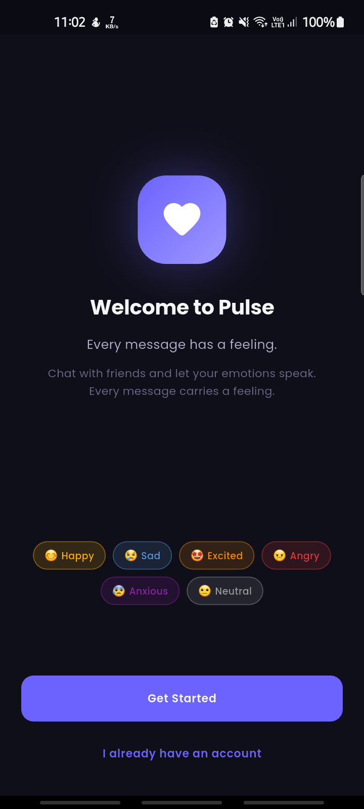
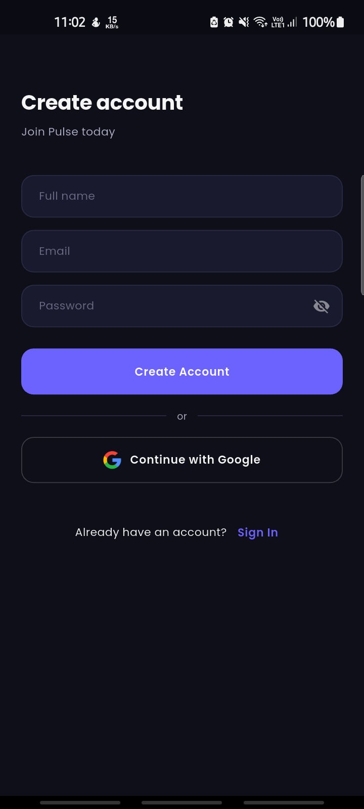
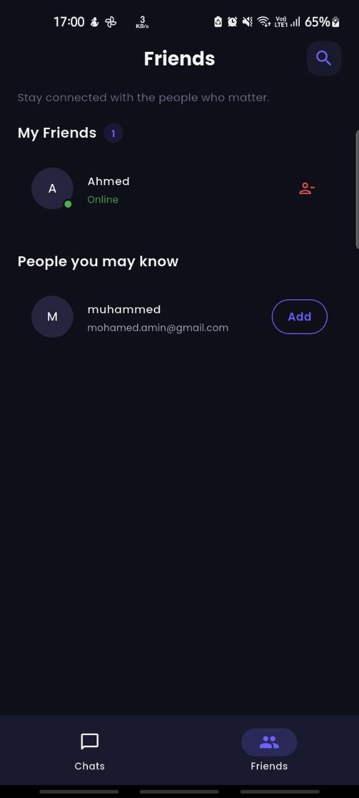
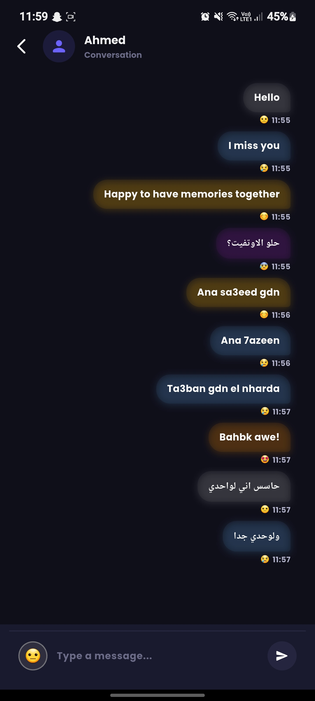

# 💜 Pulse — Every message has a feeling.

> A Flutter chat app where every message carries an emotional fingerprint. Color-coded mood bubbles, ML Kit sentiment detection, and a living emotional timeline between you and your friends.

---

## ✨ Concept

Most chat apps show you *what* people said. Pulse shows you *how* they felt when they said it.

Every message in Pulse is tagged with a mood — auto-detected by on-device ML Kit, overridable by the user. Chat bubbles are color-coded by emotion, turning every conversation into a beautiful, living emotional timeline.

---

## 📸 Screenshots

<p align="center">
  `
  `
  `
  `
</p>

---

## 🎨 Mood System

| Mood | Color | Emoji |
|------|-------|-------|
| Happy | `#FFB300` | 😊 |
| Sad | `#5C9BD6` | 😢 |
| Angry | `#E53935` | 😠 |
| Anxious | `#8E24AA` | 😰 |
| Excited | `#FB8C00` | 🤩 |
| Neutral | `#9E9E9E` | 😐 |

---

## 🏗️ Architecture

```
lib/
├── core/               # Shared constants, errors, theme, utils
├── config/             # DI (get_it/injectable) + Router (go_router)
├── features/           # Feature-first Clean Architecture
│   ├── splash/
│   ├── onboarding/
│   ├── auth/           # Phase 2
│   ├── friends/        # Phase 3
│   ├── chat/           # Phase 4
│   ├── mood/           # Phase 5
│   ├── groups/         # Phase 6
│   └── timeline/       # Phase 7
```

Each feature follows:
```
feature/
├── data/
│   ├── datasources/
│   ├── models/
│   └── repositories/
├── domain/
│   ├── entities/
│   ├── repositories/
│   └── usecases/
└── presentation/
    ├── bloc/
    ├── pages/
    └── widgets/
```

---

## 🛠️ Tech Stack

| Layer | Technology |
|-------|-----------|
| UI | Flutter + Custom Design System |
| State | BLoC / Cubit |
| DI | get_it + injectable |
| Navigation | go_router |
| Backend | Firebase (Auth, Firestore, FCM, Storage) |
| Mood Detection | ML Kit (on-device) |
| Local Storage | Hive |
| Testing | Mocktail + bloc_test |
| CI/CD | GitHub Actions |

---

## 🚀 Development Phases

- [x] **Phase 1** — Foundation (Architecture, Theme, DI, Routing)
- [ ] **Phase 2** — Authentication
- [ ] **Phase 3** — Friends System
- [ ] **Phase 4** — 1-to-1 Chat + Mood Bubbles
- [ ] **Phase 5** — Mood Engine (ML Kit + Manual Override)
- [ ] **Phase 6** — Group Chat
- [ ] **Phase 7** — Emotional Timeline Graph
- [ ] **Phase 8** — Push Notifications + Online Status
- [ ] **Phase 9** — Polish + Animations
- [ ] **Phase 10** — Play Store Release

---

## 🏃 Getting Started

```bash
# Clone the repo
git clone https://github.com/muhamedamin308/pulse.git
cd pulse

# Install dependencies
flutter pub get

# Generate DI code
flutter pub run build_runner build --delete-conflicting-outputs

# Run the app
flutter run
```

> ⚠️ Add your own `google-services.json` (Android) and `GoogleService-Info.plist` (iOS) from Firebase Console before running.

---

## 👨‍💻 Author

**Muhamed Amin Hassan** — Android & Flutter Mobile Engineer
- GitHub: [@muhamedamin308](https://github.com/muhamedamin308)
- Portfolio: [muhamedamin308.github.io/apps](https://muhamedamin308.github.io/apps/)
